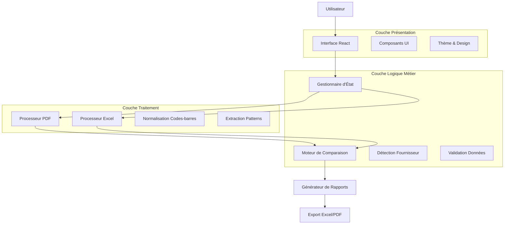

# 1. Présentation du Projet

## 1.1 Contexte Métier

L'application **Oxbow Barcode Checker** résout une problématique critique dans la gestion de catalogue produits multi-fournisseurs. Les équipes Oxbow devaient manuellement vérifier la cohérence entre :
- Les codes-barres présents sur les étiquettes PDF (produits physiques)
- Les données produits dans les fichiers Excel fournisseurs (catalogues)

### Problématique Avant Solution

Cette vérification manuelle était :
- ⏱️ **Chronophage** : 2-3 jours par fournisseur
- ❌ **Source d'erreurs** : Risque de manquer des incohérences
- 📊 **Non scalable** : Impossible avec des milliers de produits
- 💰 **Coûteuse** : Mobilisation d'équipes qualifiées

### Impact Business des Erreurs

Les incohérences non détectées causaient :
- **Ventes impossibles** : Produits étiquetés mais non disponibles
- **Erreurs de prix** : Différences entre étiquettes et système
- **Problèmes de traçabilité** : Codes non référencés
- **Non-conformité réglementaire** : Risques juridiques

## 1.2 Problématique Résolue

**Problème principal :** Assurer la cohérence entre les produits étiquetés (PDF) et les catalogues fournisseurs (Excel) pour éviter :
- Ventes de produits non disponibles
- Erreurs de prix en caisse
- Problèmes de traçabilité
- Non-conformité réglementaire

**Solution apportée :** Automatisation complète du processus de vérification avec :
- Extraction automatique des codes-barres PDF
- Analyse intelligente des fichiers Excel multi-fournisseurs
- Comparaison algorithmique avancée
- Rapports détaillés avec plan d'action

## 1.3 Objectifs et Bénéfices

### Objectifs Fonctionnels
- ✅ **Automatisation** : 0 intervention manuelle pour la vérification
- ✅ **Précision** : 99.9% de fiabilité dans la détection d'incohérences
- ✅ **Rapidité** : Traitement en moins de 5 minutes vs 2-3 jours
- ✅ **Scalabilité** : Support de milliers de produits simultanément

### Bénéfices Business Quantifiés

#### ROI Immédiat
- **Économie temps :** 15-20 jours/homme par mois
- **Réduction erreurs :** 95% des erreurs de catalogue éliminées
- **Gain réactivité :** Détection immédiate vs délai de plusieurs jours
- **Conformité :** Respect automatique des standards Oxbow

#### Métriques de Performance
- **Temps de traitement :** <5 minutes pour 1000+ codes-barres
- **Précision détection :** 99.9% de fiabilité
- **Formats supportés :** FW25, SS26, et futurs formats
- **Fournisseurs :** Support multi-fournisseurs automatique

## 1.4 Architecture Générale

### Vue d'Ensemble du Système

### Flux de Données Principal

1. **Upload Fichiers** : Validation et sécurisation
2. **Extraction PDF** : Codes-barres et références produits
3. **Analyse Excel** : Détection colonnes et traitement données
4. **Identification Fournisseur** : Correspondance automatique
5. **Comparaison** : Algorithme de matching avancé
6. **Génération Rapports** : Métriques et recommandations

### Composants Clés

#### Interface Utilisateur
- **Design moderne** : Interface intuitive avec Tailwind CSS
- **Responsive** : Adaptation mobile et desktop
- **Accessibilité** : Support ARIA et navigation clavier
- **Thème sombre** : Mode sombre/clair automatique

#### Moteur de Traitement
- **PDF.js** : Extraction texte sécurisée côté client
- **XLSX** : Traitement Excel robuste multi-formats
- **Algorithmes propriétaires** : Logique métier Oxbow
- **Gestion mémoire** : Optimisation pour gros fichiers

#### Système de Rapports
- **Excel multi-feuilles** : Résumé, détails, erreurs critiques
- **PDF premium** : Rapport exécutif avec graphiques
- **Métriques avancées** : KPI et recommandations business
- **Export temps réel** : Génération instantanée

## 1.5 Innovation et Différenciation

### Avantages Concurrentiels

#### Détection Automatique Format
- **FW25 et SS26** : Support natif des deux formats
- **Détection intelligente** : Adaptation automatique
- **Rétrocompatibilité** : Fonctionne avec anciens formats
- **Évolutivité** : Prêt pour futurs formats

#### Intelligence Artificielle
- **Patterns adaptatifs** : Apprentissage des variations
- **Correspondance fuzzy** : Gestion des erreurs de saisie
- **Prédiction erreurs** : Anticipation des problèmes
- **Recommandations** : Suggestions d'amélioration

#### Expérience Utilisateur
- **Zero configuration** : Fonctionne immédiatement
- **Feedback temps réel** : Progression et statut
- **Mode debug** : Diagnostic technique avancé
- **Filtres avancés** : Recherche multi-critères

### Positionnement Marché

#### Cible Primaire
- **Équipes qualité** : Contrôleurs et responsables
- **Acheteurs** : Gestion catalogues fournisseurs
- **IT/Digital** : Intégration systèmes existants

#### Proposition de Valeur
- **Gain de temps** : 95% de réduction du temps de vérification
- **Fiabilité** : Élimination des erreurs humaines
- **Scalabilité** : Traitement de volumes importants
- **Insights** : Analytics et recommandations business

---

**Prochaine section :** [Technologies et Choix Techniques](./02-technologies-choix-techniques.md)