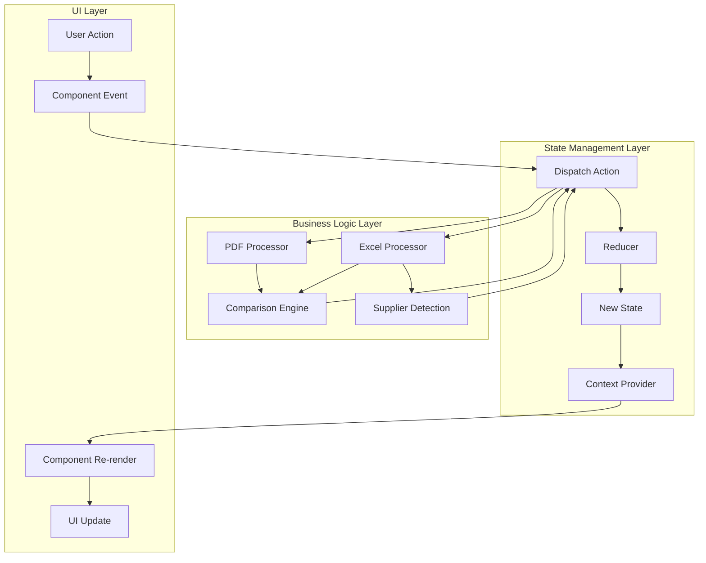

# 5. Architecture Technique Approfondie

## 5.1 Structure des Fichiers et Organisation

### Arborescence Complète du Projet

```
oxbow-barcode-checker/
├── docs/                           # 📚 Documentation technique
│   ├── README.md
│   ├── 01-presentation-projet.md
│   ├── 02-technologies-choix-techniques.md
│   ├── 03-fonctionnalites-detaillees.md
│   ├── 04-guide-utilisation.md
│   ├── 05-architecture-technique.md
│   ├── 06-maintenance-evolution.md
│   ├── 07-deploiement-configuration.md
│   ├── 08-securite-bonnes-pratiques.md
│   ├── 09-roadmap-ameliorations.md
│   └── 10-annexes-techniques.md
├── public/                         # 🌐 Assets statiques
│   ├── manifest.json              # Manifest PWA
│   ├── pwa-192x192.png           # Icônes PWA
│   ├── pwa-512x512.png
│   └── vite.svg                   # Favicon
├── src/                           # 💻 Code source principal
│   ├── components/                # 🧩 Composants UI réutilisables
│   │   ├── AdvancedFiltersPanel.tsx    # Filtres multi-critères SS26
│   │   ├── ComplianceChart.tsx         # Graphiques conformité
│   │   ├── DebugPanel.tsx              # Mode debug technique
│   │   ├── EnhancedResultsTable.tsx    # Tableau résultats avancé
│   │   ├── ExecutiveSummary.tsx        # Résumé exécutif
│   │   ├── FileUploadZone.tsx          # Zone upload drag-and-drop
│   │   ├── FilterableResultsTable.tsx  # Tableau avec filtres
│   │   ├── InteractiveComplianceChart.tsx # Graphiques interactifs
│   │   ├── Layout.tsx                  # Layout principal
│   │   ├── LoadingSpinner.tsx          # Composants de chargement
│   │   ├── MetricsCard.tsx             # Cartes métriques
│   │   ├── MissingCodesSection.tsx     # Section codes manquants
│   │   ├── NonMatchAlert.tsx           # Alertes non-correspondances
│   │   ├── ProgressBar.tsx             # Barre de progression
│   │   ├── ResultDetailModal.tsx       # Modal détail résultat
│   │   └── ResultsTable.tsx            # Tableau résultats simple
│   ├── contexts/                  # 🔄 Gestion d'état globale
│   │   ├── AppContext.tsx              # État principal application
│   │   └── ThemeContext.tsx            # Gestion thème dark/light
│   ├── pages/                     # 📄 Pages principales
│   │   ├── ProcessingPage.tsx          # Page traitement
│   │   ├── ResultsPage.tsx             # Page résultats
│   │   ├── SupplierValidationPage.tsx  # Page validation fournisseur
│   │   └── UploadPage.tsx              # Page upload
│   ├── types/                     # 📝 Définitions TypeScript
│   │   └── index.ts                    # Types principaux
│   ├── utils/                     # 🛠️ Utilitaires et logique métier
│   │   ├── barcodeNormalizer.ts        # Normalisation codes-barres
│   │   ├── comparisonEngine.ts         # Moteur de comparaison
│   │   ├── excelProcessor.ts           # Traitement fichiers Excel
│   │   ├── exportUtils.ts              # Export rapports
│   │   ├── fileValidation.ts           # Validation fichiers
│   │   ├── memoryManager.ts            # Gestion mémoire
│   │   ├── pdfProcessor.ts             # Traitement fichiers PDF
│   │   ├── performanceMonitor.ts       # Monitoring performance
│   │   ├── supplierDetection.ts        # Détection fournisseurs
│   │   └── webWorkerProcessor.ts       # Traitement arrière-plan
│   ├── App.tsx                    # 🎯 Composant racine
│   ├── main.tsx                   # 🚀 Point d'entrée
│   ├── index.css                  # 🎨 Styles globaux
│   └── vite-env.d.ts             # Types Vite
├── .gitignore                     # Git ignore
├── eslint.config.js              # Configuration ESLint
├── index.html                    # Template HTML
├── package.json                  # Dépendances et scripts
├── postcss.config.js            # Configuration PostCSS
├── tailwind.config.js           # Configuration Tailwind
├── tsconfig.app.json            # Configuration TypeScript app
├── tsconfig.json                # Configuration TypeScript
├── tsconfig.node.json           # Configuration TypeScript Node
└── vite.config.ts               # Configuration Vite
```

### Principes d'Organisation

#### Séparation des Responsabilités
```typescript
// Exemple de structure modulaire
src/
├── components/          # UI uniquement, pas de logique métier
├── utils/              # Logique métier pure, pas d'UI
├── contexts/           # Gestion d'état, pas de logique métier
├── types/              # Définitions TypeScript partagées
└── pages/              # Orchestration UI + logique
```

#### Convention de Nommage
```typescript
// Composants: PascalCase
FileUploadZone.tsx
AdvancedFiltersPanel.tsx

// Utilitaires: camelCase
barcodeNormalizer.ts
comparisonEngine.ts

// Types: PascalCase avec interface/type
interface BarcodeData { }
type ComparisonStatus = 'exact_match' | 'pdf_only';

// Constantes: UPPER_SNAKE_CASE
const MAX_FILE_SIZE = 50 * 1024 * 1024;
```

## 5.2 Composants Principaux et Responsabilités

### Composants UI (src/components/)

#### FileUploadZone - Upload Sécurisé
```typescript
interface FileUploadZoneProps {
  onFileSelect: (file: File) => void;
  accept: string;                    // Types MIME acceptés
  maxSize: number;                   // Taille max en bytes
  title: string;                     // Titre zone
  description: string;               // Description
  file?: File;                       // Fichier sélectionné
  errors?: ValidationError[];        // Erreurs validation
  isProcessing?: boolean;            // État traitement
}

// Responsabilités:
// ✅ Interface drag-and-drop
// ✅ Validation côté client
// ✅ Feedback visuel temps réel
// ✅ Gestion des erreurs
// ❌ Pas de traitement des fichiers
// ❌ Pas de logique métier
```

#### AdvancedFiltersPanel - Filtrage Multi-Critères
```typescript
interface AdvancedFiltersPanelProps {
  results: ComparisonResult[];
  filters: FilterOptions;
  onFiltersChange: (filters: FilterOptions) => void;
  isVisible: boolean;
  onToggle: () => void;
}

// Responsabilités:
// ✅ Interface de filtrage avancée
// ✅ Extraction automatique des options
// ✅ Sauvegarde/chargement filtres
// ✅ Filtres SS26 (couleurs, tailles, prix)
// ❌ Pas de logique de filtrage
// ❌ Pas de manipulation des données
```

#### InteractiveComplianceChart - Graphiques Avancés
```typescript
interface InteractiveComplianceChartProps {
  metrics: ComplianceMetrics;
  results: ComparisonResult[];
}

// Responsabilités:
// ✅ Visualisation données interactive
// ✅ Graphiques multiples (secteurs, barres, lignes)
// ✅ Navigation par onglets
// ✅ Export graphiques
// ❌ Pas de calcul des métriques
// ❌ Pas de traitement des données
```

### Gestionnaires d'État (src/contexts/)

#### AppContext - État Central
```typescript
interface AppState {
  // Navigation
  step: 'upload' | 'supplier-validation' | 'processing' | 'results';
  progress: number;
  message: string;
  
  // Fichiers
  pdfFile?: File;
  excelFile?: File;
  
  // Données
  barcodes: BarcodeData[];
  results: ComparisonResult[];
  
  // Fournisseurs
  detectedSupplier?: SupplierInfo;
  availableSuppliers?: SupplierInfo[];
  selectedSupplier?: SupplierInfo;
  
  // Métadonnées
  detectedFormat?: 'FW25' | 'SS26' | 'MIXED';
  pdfCodeCount?: number;
  
  // État
  isProcessing: boolean;
  error: string | null;
}

// Actions typées pour mutations sécurisées
type AppAction = 
  | { type: 'SET_STEP'; payload: ProcessingState['step'] }
  | { type: 'SET_FILES'; payload: { pdfFile?: File; excelFile?: File } }
  | { type: 'SET_RESULTS'; payload: ComparisonResult[] }
  | { type: 'SET_DETECTED_FORMAT'; payload: 'FW25' | 'SS26' | 'MIXED' }
  | { type: 'SET_PROCESSING'; payload: boolean }
  | { type: 'SET_ERROR'; payload: string | null };

// Reducer pour mutations contrôlées
function appReducer(state: AppState, action: AppAction): AppState {
  switch (action.type) {
    case 'SET_STEP':
      return { ...state, step: action.payload };
    case 'SET_FILES':
      return { ...state, ...action.payload };
    case 'SET_RESULTS':
      return { ...state, results: action.payload };
    case 'SET_DETECTED_FORMAT':
      return { ...state, detectedFormat: action.payload };
    case 'SET_PROCESSING':
      return { ...state, isProcessing: action.payload };
    case 'SET_ERROR':
      return { ...state, error: action.payload };
    default:
      return state;
  }
}
```

### Utilitaires Métier (src/utils/)

#### comparisonEngine.ts - Cœur de la Logique
```typescript
// Fonctions principales exportées:

export function compareData(
  pdfBarcodes: BarcodeData[], 
  excelBarcodes: BarcodeData[]
): ComparisonResult[]

export function calculateComplianceMetrics(
  results: ComparisonResult[], 
  supplierName?: string,
  originalPdfCount?: number
): ComplianceMetrics

export function filterResults(
  results: ComparisonResult[], 
  filters: FilterOptions
): ComparisonResult[]

// Responsabilités:
// ✅ Algorithmes de comparaison
// ✅ Calcul des métriques
// ✅ Logique de filtrage
// ✅ Détection format SS26/FW25
// ❌ Pas d'interface utilisateur
// ❌ Pas de gestion d'état
```

#### excelProcessor.ts - Traitement Excel Robuste
```typescript
// Fonctions principales:

export async function extractDataFromExcel(file: File): Promise<BarcodeData[]>

export async function extractDataFromExcelWithDebug(file: File): Promise<{
  data: BarcodeData[];
  debug: DebugInfo;
}>

// Architecture interne:
const COLUMN_DETECTORS = {
  barcode: { names: [...], validator: (value) => boolean, confidence: (values) => number },
  priceEuro: { names: [...], validator: (value) => boolean, confidence: (values) => number },
  color: { names: [...], validator: (value) => boolean, confidence: (values) => number },
  // ... autres détecteurs
};

// Responsabilités:
// ✅ Détection automatique colonnes
// ✅ Validation et nettoyage données
// ✅ Support multi-formats (SS26/FW25)
// ✅ Gestion erreurs et debug
// ✅ Optimisation mémoire (chunks)
// ❌ Pas d'interface utilisateur
```

#### pdfProcessor.ts - Extraction PDF Universelle
```typescript
// Fonction principale:
export async function extractBarcodesFromPdf(file: File): Promise<{
  barcodes: BarcodeData[];
  productReferences: ProductReference[];
  fullText: string;
  debugInfo: any;
}>

// Patterns universels OXBOW:
const universalPatterns = [
  { name: 'FW25', pattern: /3\s*605\s*168\s*\d{6}/g },
  { name: 'SS26', pattern: /3\s*6051\s*68\s*\d{6}/g },
  { name: 'Complet', pattern: /3605168\d{6}/g },
  { name: 'Ultra-flexible', pattern: /3\s*6\s*0\s*5\s*1\s*6\s*8\s*\d{6}/g }
];

// Responsabilités:
// ✅ Extraction texte PDF sécurisée
// ✅ Patterns multiples avec fallbacks
// ✅ Validation format OXBOW
// ✅ Extraction références produits
// ❌ Pas de traitement Excel
// ❌ Pas de comparaison
```

## 5.3 Flux de Données et Gestion d'État

### Architecture Flux Unidirectionnel



### Cycle de Vie Complet d'une Analyse

```typescript
// 1. Upload fichiers (UploadPage)
const handleFileSelect = async (pdfFile: File, excelFile: File) => {
  dispatch({ type: 'SET_FILES', payload: { pdfFile, excelFile } });
  
  // 2. Analyse préliminaire
  try {
    const { data: excelData, debug } = await extractDataFromExcelWithDebug(excelFile);
    const { productReferences } = await extractBarcodesFromPdf(pdfFile);
    
    // 3. Détection format
    const formatDetected = detectFormat(excelData);
    dispatch({ type: 'SET_DETECTED_FORMAT', payload: formatDetected });
    
    // 4. Détection fournisseur
    const availableSuppliers = getAvailableSuppliers(excelData);
    dispatch({ type: 'SET_AVAILABLE_SUPPLIERS', payload: availableSuppliers });
    
    const detectedSupplier = identifySupplier(productReferences, excelData);
    if (detectedSupplier) {
      dispatch({ type: 'SET_DETECTED_SUPPLIER', payload: detectedSupplier });
    }
    
    // 5. Navigation vers validation fournisseur
    dispatch({ type: 'SET_STEP', payload: 'supplier-validation' });
    
  } catch (error) {
    dispatch({ type: 'SET_ERROR', payload: error.message });
  }
};

// 6. Validation fournisseur (SupplierValidationPage)
const handleSupplierConfirmation = (selectedSupplier: SupplierInfo) => {
  dispatch({ type: 'SET_SELECTED_SUPPLIER', payload: selectedSupplier });
  dispatch({ type: 'SET_STEP', payload: 'processing' });
};

// 7. Traitement complet (ProcessingPage)
const processFiles = async () => {
  dispatch({ type: 'SET_PROCESSING', payload: true });
  
  try {
    // Extraction complète
    const { barcodes: pdfBarcodes } = await extractBarcodesFromPdf(state.pdfFile);
    const excelData = await extractDataFromExcel(state.excelFile);
    
    // Filtrage par fournisseur
    const filteredExcelData = filterExcelBySupplier(excelData, state.selectedSupplier);
    
    // Comparaison
    const results = compareData(pdfBarcodes, filteredExcelData);
    
    // Sauvegarde résultats
    dispatch({ type: 'SET_RESULTS', payload: results });
    dispatch({ type: 'SET_PDF_COUNT', payload: pdfBarcodes.length });
    
    // Navigation vers résultats
    dispatch({ type: 'SET_STEP', payload: 'results' });
    
  } catch (error) {
    dispatch({ type: 'SET_ERROR', payload: error.message });
  } finally {
    dispatch({ type: 'SET_PROCESSING', payload: false });
  }
};

// 8. Affichage résultats (ResultsPage)
const metrics = calculateComplianceMetrics(state.results, state.selectedSupplier?.name, state.pdfCodeCount);
```

### Gestion des Effets de Bord

#### Pattern useEffect pour Traitement Asynchrone
```typescript
// ProcessingPage.tsx
useEffect(() => {
  const processFiles = async () => {
    if (!state.pdfFile || !state.excelFile || !state.selectedSupplier) return;

    dispatch({ type: 'SET_PROCESSING', payload: true });
    dispatch({ type: 'SET_ERROR', payload: null });

    try {
      // Étapes de traitement avec feedback
      dispatch({ type: 'SET_MESSAGE', payload: 'Extraction des codes-barres du PDF...' });
      dispatch({ type: 'SET_PROGRESS', payload: 10 });
      
      const { barcodes: pdfBarcodes } = await extractBarcodesFromPdf(state.pdfFile);
      dispatch({ type: 'SET_PROGRESS', payload: 40 });

      dispatch({ type: 'SET_MESSAGE', payload: `Filtrage des données pour ${state.selectedSupplier.name}...` });
      const filteredExcelData = filterExcelBySupplier(state.barcodes, state.selectedSupplier);
      dispatch({ type: 'SET_PROGRESS', payload: 70 });

      dispatch({ type: 'SET_MESSAGE', payload: 'Comparaison PDF → Excel...' });
      const results = compareData(pdfBarcodes, filteredExcelData);
      dispatch({ type: 'SET_PROGRESS', payload: 90 });

      // Finalisation
      dispatch({ type: 'SET_RESULTS', payload: results });
      dispatch({ type: 'SET_PROGRESS', payload: 100 });
      
      setTimeout(() => {
        dispatch({ type: 'SET_STEP', payload: 'results' });
        dispatch({ type: 'SET_PROCESSING', payload: false });
      }, 1500);

    } catch (error) {
      dispatch({ type: 'SET_ERROR', payload: error.message });
      dispatch({ type: 'SET_PROCESSING', payload: false });
    }
  };

  processFiles();
}, [state.pdfFile, state.excelFile, state.selectedSupplier, dispatch]);
```

## 5.4 APIs et Interfaces Utilisées

### PDF.js API - Extraction Sécurisée

#### Configuration et Utilisation
```typescript
// Configuration worker pour performance
import * as pdfjsLib from 'pdfjs-dist';

pdfjsLib.GlobalWorkerOptions.workerSrc = 
  `//cdnjs.cloudflare.com/ajax/libs/pdf.js/${pdfjsLib.version}/pdf.worker.min.js`;

// Extraction texte page par page
export async function extractBarcodesFromPdf(file: File) {
  const arrayBuffer = await file.arrayBuffer();
  const pdf = await pdfjsLib.getDocument({ data: arrayBuffer }).promise;
  
  let fullText = '';
  for (let i = 1; i <= pdf.numPages; i++) {
    const page = await pdf.getPage(i);
    const textContent = await page.getTextContent();
    const pageText = textContent.items
      .map((item: any) => item.str)
      .join(' ');
    fullText += pageText + '\n';
  }
  
  return extractBarcodesFromText(fullText);
}
```

#### Avantages de PDF.js
- **Sécurité** : Pas d'exécution de code malveillant
- **Performance** : Web Workers automatiques
- **Compatibilité** : Support tous navigateurs modernes
- **Précision** : Extraction texte fidèle

### XLSX API - Traitement Excel Robuste

#### Configuration Avancée
```typescript
import * as XLSX from 'xlsx';

// Lecture avec options optimisées
const workbook = XLSX.read(arrayBuffer, { 
  type: 'array',
  cellDates: true,        // Conversion dates automatique
  cellNF: false,          // Pas de formatage numérique
  cellText: false,        // Pas de conversion texte
  raw: false,             // Conversion en valeurs
  codepage: 65001         // UTF-8 par défaut
});

// Sélection intelligente de feuille
const sheetPriorities = [
  'Main sheet',           // SS26 standard
  'Sheet1',              // Défaut Excel
  'AH 25',               // FW25 standard
  'Data', 'Produits'     // Noms courants
];

// Conversion en JSON avec gestion erreurs
const jsonData = XLSX.utils.sheet_to_json(worksheet, { 
  header: 1,              // Première ligne = en-têtes
  defval: '',            // Valeur par défaut cellules vides
  blankrows: false       // Ignorer lignes vides
});
```

### Chart.js API - Visualisation Avancée

#### Configuration Graphiques Interactifs
```typescript
import {
  Chart as ChartJS,
  ArcElement,
  Tooltip,
  Legend,
  CategoryScale,
  LinearScale,
  BarElement,
  LineElement,
  PointElement,
  Title,
} from 'chart.js';

// Enregistrement composants nécessaires
ChartJS.register(
  ArcElement, Tooltip, Legend,
  CategoryScale, LinearScale,
  BarElement, LineElement, PointElement,
  Title
);

// Configuration graphique avec thème Oxbow
const chartOptions = {
  responsive: true,
  maintainAspectRatio: false,
  plugins: {
    legend: { 
      position: 'bottom',
      labels: {
        padding: 20,
        usePointStyle: true,
        font: { size: 12 }
      }
    },
    tooltip: {
      backgroundColor: 'rgba(0, 0, 0, 0.8)',
      titleColor: 'white',
      bodyColor: 'white',
      borderColor: '#2B5CE6',
      borderWidth: 1,
      callbacks: {
        label: function(context) {
          const percentage = ((context.parsed / total) * 100).toFixed(1);
          return `${context.label}: ${context.parsed} (${percentage}%)`;
        }
      }
    }
  },
  scales: {
    y: {
      beginAtZero: true,
      ticks: {
        callback: function(value) {
          return value + '%';
        }
      }
    }
  }
};
```

### Framer Motion API - Animations Fluides

#### Animations Déclaratives
```typescript
import { motion, AnimatePresence } from 'framer-motion';

// Animation d'entrée/sortie
<AnimatePresence mode="wait">
  {isVisible && (
    <motion.div
      initial={{ opacity: 0, y: 20 }}
      animate={{ opacity: 1, y: 0 }}
      exit={{ opacity: 0, y: -20 }}
      transition={{ duration: 0.3 }}
    >
      {content}
    </motion.div>
  )}
</AnimatePresence>

// Animation de liste
{items.map((item, index) => (
  <motion.div
    key={item.id}
    initial={{ opacity: 0, x: -20 }}
    animate={{ opacity: 1, x: 0 }}
    transition={{ delay: index * 0.1 }}
  >
    {item.content}
  </motion.div>
))}

// Animation interactive
<motion.button
  whileHover={{ scale: 1.05 }}
  whileTap={{ scale: 0.95 }}
  className="btn-primary"
>
  Cliquer
</motion.button>
```

## 5.5 Optimisations et Performance

### Lazy Loading des Composants

#### Code Splitting Automatique
```typescript
// App.tsx - Lazy loading des pages
import { Suspense, lazy } from 'react';

const UploadPage = lazy(() => 
  import('./pages/UploadPage').then(module => ({ 
    default: module.UploadPage 
  }))
);

const ResultsPage = lazy(() => 
  import('./pages/ResultsPage').then(module => ({ 
    default: module.ResultsPage 
  }))
);

function App() {
  return (
    <Suspense fallback={
      <div className="flex items-center justify-center min-h-[400px]">
        <LoadingSpinner size="lg" />
      </div>
    }>
      <Routes>
        <Route path="/" element={<UploadPage />} />
        <Route path="/results" element={<ResultsPage />} />
      </Routes>
    </Suspense>
  );
}
```

### Memoization et Optimisations React

#### useMemo pour Calculs Coûteux
```typescript
// Calcul des options de filtrage
const availableOptions = useMemo(() => {
  const colors = new Set<string>();
  const sizes = new Set<string>();
  const suppliers = new Set<string>();
  
  results.forEach(result => {
    if (result.excelData?.color) colors.add(result.excelData.color);
    if (result.excelData?.size) sizes.add(result.excelData.size);
    if (result.excelData?.supplier) suppliers.add(result.excelData.supplier);
  });
  
  return {
    colors: Array.from(colors).sort(),
    sizes: Array.from(sizes).sort(sizeComparator),
    suppliers: Array.from(suppliers).sort()
  };
}, [results]);

// Filtrage des résultats
const filteredResults = useMemo(() => {
  return filterResults(results, filters);
}, [results, filters]);
```

#### useCallback pour Fonctions Stables
```typescript
// Fonction de recherche avec debounce
const debouncedSearch = useCallback(
  debounce((term: string) => {
    setFilters(prev => ({ ...prev, searchTerm: term }));
  }, 300),
  []
);

// Gestionnaire d'événement stable
const handleFileSelect = useCallback((file: File) => {
  dispatch({ type: 'SET_FILES', payload: { pdfFile: file } });
}, [dispatch]);
```

### Gestion Mémoire Optimisée

#### Traitement par Chunks
```typescript
// excelProcessor.ts - Traitement par chunks
async function processDataInChunks(
  rawData: any[][],
  columnMapping: { [key: string]: number },
  debug: DebugInfo
): Promise<BarcodeData[]> {
  const CHUNK_SIZE = 1000;
  const chunks = [];
  
  // Découpage en chunks
  for (let i = 0; i < rawData.length; i += CHUNK_SIZE) {
    chunks.push(rawData.slice(i, i + CHUNK_SIZE));
  }

  const results: BarcodeData[] = [];
  
  for (const chunk of chunks) {
    // Traitement du chunk
    const chunkResults = await processChunk(chunk, columnMapping);
    results.push(...chunkResults);
    
    // Pause pour éviter de bloquer l'UI
    await new Promise(resolve => setTimeout(resolve, 0));
  }
  
  return results;
}
```

#### Nettoyage Automatique
```typescript
// memoryManager.ts - Gestionnaire mémoire
class MemoryManager {
  private cache = new Map();
  
  cleanup(): void {
    this.cache.clear();
    
    // Forcer garbage collection si disponible
    if ('gc' in window) {
      (window as any).gc();
    }
  }
  
  isMemoryCritical(): boolean {
    const stats = this.getMemoryStats();
    return stats.percentage > 85;
  }
}

// Nettoyage automatique périodique
setInterval(() => {
  if (memoryManager.isMemoryCritical()) {
    memoryManager.cleanup();
  }
}, 10000);
```

---

**Prochaine section :** [Maintenance et Évolution](./06-maintenance-evolution.md)