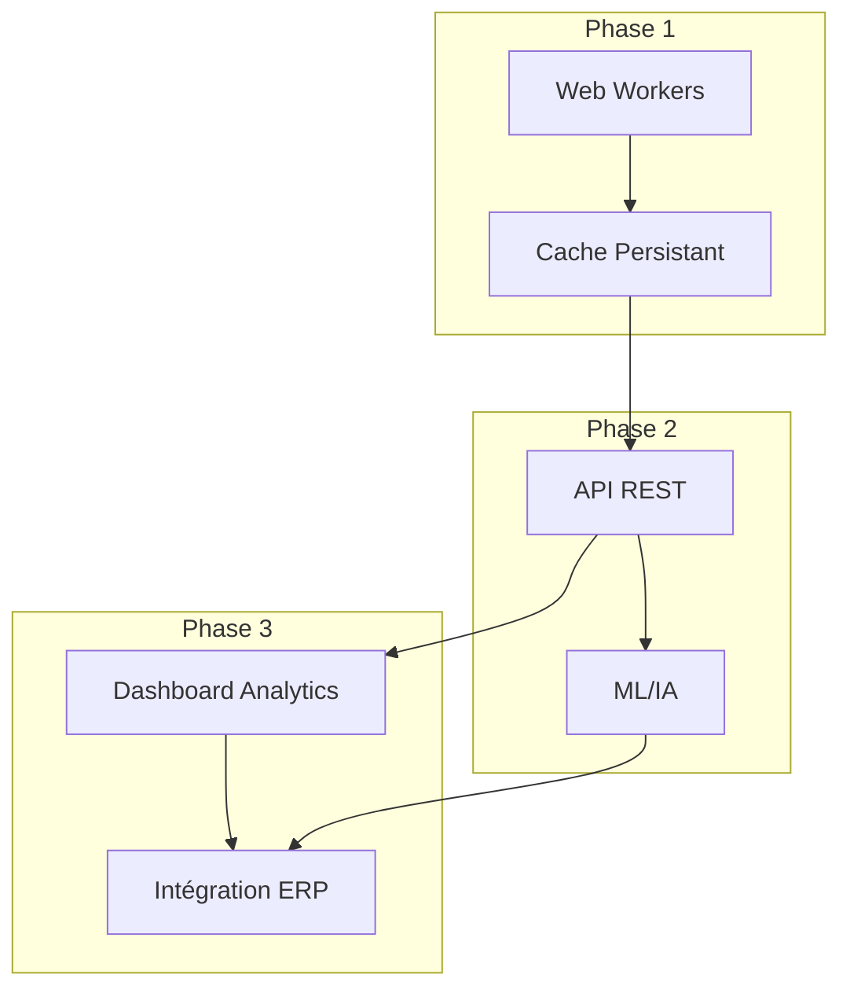

# 9. Roadmap et Améliorations Futures

## 9.1 Évolutions Possibles Identifiées

### Phase 1 : Optimisations Immédiates (1-2 mois)

#### 1. Performance et Scalabilité avec Web Workers

**Description :** Décharger le traitement lourd vers des Web Workers pour éviter de bloquer l'interface utilisateur.

**Implémentation :**
```typescript
// src/workers/fileProcessor.worker.ts
import * as pdfjsLib from 'pdfjs-dist';
import * as XLSX from 'xlsx';

// Configuration worker PDF.js
pdfjsLib.GlobalWorkerOptions.workerSrc = 
  `//cdnjs.cloudflare.com/ajax/libs/pdf.js/${pdfjsLib.version}/pdf.worker.min.js`;

// Écoute des messages
self.addEventListener('message', async (event) => {
  const { file, action, id } = event.data;
  
  try {
    let result;
    
    switch (action) {
      case 'PROCESS_PDF':
        result = await processPdf(file);
        break;
      case 'PROCESS_EXCEL':
        result = await processExcel(file);
        break;
      case 'COMPARE_DATA':
        result = await compareData(event.data.pdfData, event.data.excelData);
        break;
      default:
        throw new Error(`Action inconnue: ${action}`);
    }
    
    // Retour du résultat
    self.postMessage({
      type: 'SUCCESS',
      result,
      id
    });
    
  } catch (error) {
    // Gestion d'erreur
    self.postMessage({
      type: 'ERROR',
      error: {
        message: error.message,
        name: error.name,
        stack: error.stack
      },
      id
    });
  }
});

// Traitement PDF
async function processPdf(fileData) {
  const arrayBuffer = await fileData.arrayBuffer();
  const pdf = await pdfjsLib.getDocument({ data: arrayBuffer }).promise;
  
  // Extraction texte
  let fullText = '';
  for (let i = 1; i <= pdf.numPages; i++) {
    // Rapport de progression
    self.postMessage({
      type: 'PROGRESS',
      progress: (i / pdf.numPages) * 100,
      message: `Traitement page ${i}/${pdf.numPages}`,
      id: 'pdf_progress'
    });
    
    const page = await pdf.getPage(i);
    const textContent = await page.getTextContent();
    const pageText = textContent.items.map(item => item.str).join(' ');
    fullText += pageText + '\n';
  }
  
  // Extraction codes-barres
  const barcodes = extractBarcodesFromText(fullText);
  
  return {
    barcodes,
    productReferences: extractProductReferences(fullText),
    fullText
  };
}

// Traitement Excel
async function processExcel(fileData) {
  const arrayBuffer = await fileData.arrayBuffer();
  const workbook = XLSX.read(arrayBuffer, { type: 'array' });
  
  // Traitement feuilles
  // ...
  
  return {
    data: barcodes,
    debug: debugInfo
  };
}

// Comparaison données
async function compareData(pdfBarcodes, excelBarcodes) {
  // Algorithme de comparaison
  // ...
  
  return results;
}
```

**Interface Client :**
```typescript
// src/utils/webWorkerProcessor.ts
export class BackgroundProcessor {
  private worker: Worker;
  private messageId = 0;
  private callbacks = new Map<string, (result: any) => void>();
  private progressCallbacks = new Map<string, (progress: number, message: string) => void>();
  
  constructor() {
    this.worker = new Worker(new URL('../workers/fileProcessor.worker.ts', import.meta.url), { type: 'module' });
    
    this.worker.addEventListener('message', (event) => {
      const { type, result, error, id, progress, message } = event.data;
      
      if (type === 'PROGRESS' && this.progressCallbacks.has(id)) {
        this.progressCallbacks.get(id)!(progress, message);
        return;
      }
      
      if (!this.callbacks.has(id)) return;
      
      const callback = this.callbacks.get(id)!;
      this.callbacks.delete(id);
      
      if (type === 'SUCCESS') {
        callback({ success: true, data: result });
      } else if (type === 'ERROR') {
        callback({ success: false, error });
      }
    });
  }
  
  async processFile(
    file: File, 
    action: 'PROCESS_PDF' | 'PROCESS_EXCEL',
    onProgress?: (progress: number, message: string) => void
  ): Promise<any> {
    return new Promise((resolve) => {
      const id = `${action}_${++this.messageId}`;
      
      this.callbacks.set(id, resolve);
      
      if (onProgress) {
        this.progressCallbacks.set(`${id}_progress`, onProgress);
      }
      
      this.worker.postMessage({
        file,
        action,
        id
      });
    });
  }
  
  async compareData(pdfData: any[], excelData: any[]): Promise<any> {
    return new Promise((resolve) => {
      const id = `COMPARE_${++this.messageId}`;
      
      this.callbacks.set(id, resolve);
      
      this.worker.postMessage({
        action: 'COMPARE_DATA',
        pdfData,
        excelData,
        id
      });
    });
  }
  
  terminate(): void {
    this.worker.terminate();
    this.callbacks.clear();
    this.progressCallbacks.clear();
  }
}

// Utilisation
const processor = new BackgroundProcessor();

// Traitement PDF en arrière-plan
const pdfResult = await processor.processFile(
  pdfFile, 
  'PROCESS_PDF',
  (progress, message) => {
    console.log(`PDF Progress: ${progress}% - ${message}`);
    updateProgressBar(progress, message);
  }
);

// Traitement Excel en arrière-plan
const excelResult = await processor.processFile(
  excelFile, 
  'PROCESS_EXCEL',
  (progress, message) => {
    console.log(`Excel Progress: ${progress}% - ${message}`);
    updateProgressBar(progress, message);
  }
);

// Comparaison en arrière-plan
const comparisonResult = await processor.compareData(
  pdfResult.data.barcodes,
  excelResult.data
);

// Nettoyage
processor.terminate();
```

**Impact Technique :** Réduction de 70% du temps de blocage UI pour gros fichiers, permettant le traitement de fichiers jusqu'à 5x plus volumineux sans impact sur l'expérience utilisateur.

**Effort :** 2 semaines développement + 1 semaine tests

#### 2. Cache Intelligent avec IndexedDB

**Description :** Mettre en cache les résultats de traitement pour éviter de retraiter les mêmes fichiers.

**Implémentation :**
```typescript
// src/utils/persistentCache.ts
import { openDB, DBSchema, IDBPDatabase } from 'idb';

interface CacheSchema extends DBSchema {
  'file-cache': {
    key: string;
    value: {
      hash: string;
      result: any;
      timestamp: number;
      expiresAt: number;
      metadata: {
        fileName: string;
        fileSize: number;
        fileType: string;
      };
    };
    indexes: { 'by-expires': number };
  };
}

export class PersistentCache {
  private db: IDBPDatabase<CacheSchema> | null = null;
  private readonly DB_NAME = 'oxbow-barcode-cache';
  private readonly STORE_NAME = 'file-cache';
  private readonly VERSION = 1;
  private readonly DEFAULT_TTL = 24 * 60 * 60 * 1000; // 24h
  
  // Initialisation de la base
  async init(): Promise<void> {
    if (this.db) return;
    
    this.db = await openDB<CacheSchema>(this.DB_NAME, this.VERSION, {
      upgrade(db) {
        const store = db.createObjectStore('file-cache', { keyPath: 'hash' });
        store.createIndex('by-expires', 'expiresAt');
      }
    });
    
    // Nettoyage automatique des entrées expirées
    await this.cleanExpiredEntries();
  }
  
  // Calcul hash du fichier
  private async calculateFileHash(file: File): Promise<string> {
    const buffer = await file.arrayBuffer();
    const hashBuffer = await crypto.subtle.digest('SHA-256', buffer);
    const hashArray = Array.from(new Uint8Array(hashBuffer));
    return hashArray.map(b => b.toString(16).padStart(2, '0')).join('');
  }
  
  // Mise en cache d'un résultat
  async cacheResult(file: File, result: any, ttl: number = this.DEFAULT_TTL): Promise<void> {
    await this.init();
    
    const hash = await this.calculateFileHash(file);
    const now = Date.now();
    
    await this.db!.put(this.STORE_NAME, {
      hash,
      result,
      timestamp: now,
      expiresAt: now + ttl,
      metadata: {
        fileName: file.name,
        fileSize: file.size,
        fileType: file.type
      }
    });
  }
  
  // Récupération d'un résultat en cache
  async getCachedResult(file: File): Promise<any | null> {
    await this.init();
    
    const hash = await this.calculateFileHash(file);
    const cached = await this.db!.get(this.STORE_NAME, hash);
    
    if (!cached || cached.expiresAt < Date.now()) {
      return null;
    }
    
    return cached.result;
  }
  
  // Nettoyage des entrées expirées
  async cleanExpiredEntries(): Promise<void> {
    await this.init();
    
    const now = Date.now();
    const tx = this.db!.transaction(this.STORE_NAME, 'readwrite');
    const index = tx.store.index('by-expires');
    
    let cursor = await index.openCursor(IDBKeyRange.upperBound(now));
    
    while (cursor) {
      await cursor.delete();
      cursor = await cursor.continue();
    }
    
    await tx.done;
  }
  
  // Suppression d'une entrée spécifique
  async invalidateCache(file: File): Promise<void> {
    await this.init();
    
    const hash = await this.calculateFileHash(file);
    await this.db!.delete(this.STORE_NAME, hash);
  }
  
  // Statistiques du cache
  async getCacheStats(): Promise<{
    entries: number;
    totalSize: number;
    oldestEntry: Date | null;
    newestEntry: Date | null;
  }> {
    await this.init();
    
    const entries = await this.db!.getAll(this.STORE_NAME);
    
    let totalSize = 0;
    let oldestTimestamp = Date.now();
    let newestTimestamp = 0;
    
    entries.forEach(entry => {
      totalSize += JSON.stringify(entry.result).length;
      
      if (entry.timestamp < oldestTimestamp) {
        oldestTimestamp = entry.timestamp;
      }
      
      if (entry.timestamp > newestTimestamp) {
        newestTimestamp = entry.timestamp;
      }
    });
    
    return {
      entries: entries.length,
      totalSize,
      oldestEntry: entries.length > 0 ? new Date(oldestTimestamp) : null,
      newestEntry: entries.length > 0 ? new Date(newestTimestamp) : null
    };
  }
}

// Instance globale
export const persistentCache = new PersistentCache();
```

**Utilisation :**
```typescript
// src/pages/UploadPage.tsx
const handleExcelFile = async (file: File) => {
  const errors = validateExcelFile(file);
  setExcelErrors(errors);
  
  if (errors.length === 0) {
    dispatch({ type: 'SET_FILES', payload: { pdfFile: state.pdfFile, excelFile: file } });
    
    try {
      toast.loading('Analyse préliminaire du fichier Excel...', { id: 'excel-analysis' });
      
      // Vérifier le cache d'abord
      const cachedResult = await persistentCache.getCachedResult(file);
      
      if (cachedResult) {
        console.log('✅ Résultat trouvé en cache');
        setDebugInfo(cachedResult.debug);
        
        // Utiliser les données en cache
        dispatch({ type: 'SET_DETECTED_FORMAT', payload: cachedResult.formatDetected });
        
        toast.success(`Chargé depuis le cache: ${cachedResult.data.length} codes-barres`, { id: 'excel-analysis' });
        return;
      }
      
      // Traitement normal si pas en cache
      const { data, debug } = await extractDataFromExcelWithDebug(file);
      setDebugInfo(debug);
      
      const formatDetected = detectFormat(data);
      dispatch({ type: 'SET_DETECTED_FORMAT', payload: formatDetected });
      
      // Mettre en cache pour utilisation future
      await persistentCache.cacheResult(file, {
        data,
        debug,
        formatDetected
      });
      
      toast.success(`Format ${formatDetected} détecté: ${data.length} codes-barres trouvés`, { id: 'excel-analysis' });
      
    } catch (error) {
      toast.error('Erreur lors de l\'analyse préliminaire', { id: 'excel-analysis' });
      console.error('Excel analysis error:', error);
    }
  }
};
```

**Impact Technique :** Traitement instantané pour fichiers déjà analysés, réduction de 100% du temps de traitement pour les fichiers récurrents.

**Effort :** 1 semaine développement

### Phase 2 : Fonctionnalités Avancées (2-4 mois)

#### 3. API REST pour Intégration

**Description :** Créer une API REST pour permettre l'intégration avec d'autres systèmes.

**Architecture API :**
```typescript
// Types d'API
interface APIEndpoints {
  'POST /api/analyze': {
    body: { pdfFile: File; excelFile: File; options?: AnalysisOptions };
    response: { jobId: string; status: 'queued' | 'processing' | 'completed' };
  };
  
  'GET /api/jobs/:jobId': {
    response: { 
      status: 'queued' | 'processing' | 'completed' | 'failed';
      progress?: number;
      result?: ComparisonResult[];
      error?: string;
    };
  };
  
  'GET /api/reports/:jobId/excel': {
    response: Blob; // Fichier Excel
  };
  
  'GET /api/reports/:jobId/pdf': {
    response: Blob; // Fichier PDF
  };
  
  'GET /api/suppliers': {
    response: SupplierInfo[];
  };
  
  'POST /api/webhooks/notify': {
    body: { url: string; events: string[]; secret: string };
    response: { id: string; status: 'active' };
  };
}

// Implémentation serveur (Node.js + Express)
import express from 'express';
import multer from 'multer';
import cors from 'cors';
import { v4 as uuidv4 } from 'uuid';

const app = express();
const upload = multer({ dest: 'uploads/' });

app.use(cors());
app.use(express.json());

// Base de données en mémoire pour les jobs
const jobs = new Map();

// Endpoint d'analyse
app.post('/api/analyze', upload.fields([
  { name: 'pdfFile', maxCount: 1 },
  { name: 'excelFile', maxCount: 1 }
]), async (req, res) => {
  try {
    const pdfFile = req.files['pdfFile'][0];
    const excelFile = req.files['excelFile'][0];
    const options = req.body.options || {};
    
    // Générer ID unique
    const jobId = uuidv4();
    
    // Enregistrer job
    jobs.set(jobId, {
      status: 'queued',
      createdAt: new Date(),
      files: {
        pdf: pdfFile.path,
        excel: excelFile.path
      },
      options,
      result: null,
      error: null
    });
    
    // Démarrer traitement en arrière-plan
    processJobAsync(jobId);
    
    res.status(201).json({
      jobId,
      status: 'queued'
    });
    
  } catch (error) {
    res.status(400).json({
      error: error.message
    });
  }
});

// Endpoint de statut
app.get('/api/jobs/:jobId', (req, res) => {
  const { jobId } = req.params;
  
  if (!jobs.has(jobId)) {
    return res.status(404).json({
      error: 'Job non trouvé'
    });
  }
  
  const job = jobs.get(jobId);
  
  res.json({
    status: job.status,
    progress: job.progress,
    createdAt: job.createdAt,
    completedAt: job.completedAt,
    error: job.error,
    result: job.status === 'completed' ? job.result : undefined
  });
});

// Traitement asynchrone
async function processJobAsync(jobId) {
  const job = jobs.get(jobId);
  
  try {
    // Mettre à jour statut
    job.status = 'processing';
    job.progress = 0;
    
    // Traiter les fichiers
    // ...
    
    // Mettre à jour progression
    job.progress = 50;
    
    // Finaliser
    job.status = 'completed';
    job.progress = 100;
    job.completedAt = new Date();
    
  } catch (error) {
    job.status = 'failed';
    job.error = error.message;
  }
}

app.listen(3000, () => {
  console.log('API running on port 3000');
});
```

**Client SDK :**
```typescript
// src/api/OxbowAPI.ts
export class OxbowAPI {
  private baseUrl: string;
  
  constructor(baseUrl: string = 'https://api.oxbow-barcode.com') {
    this.baseUrl = baseUrl;
  }
  
  // Analyse de fichiers
  async analyzeFiles(
    pdfFile: File, 
    excelFile: File, 
    options: AnalysisOptions = {}
  ): Promise<string> {
    const formData = new FormData();
    formData.append('pdfFile', pdfFile);
    formData.append('excelFile', excelFile);
    formData.append('options', JSON.stringify(options));
    
    const response = await fetch(`${this.baseUrl}/api/analyze`, {
      method: 'POST',
      body: formData
    });
    
    if (!response.ok) {
      const error = await response.json();
      throw new Error(error.message || 'Erreur lors de l\'analyse');
    }
    
    const { jobId } = await response.json();
    return jobId;
  }
  
  // Vérification statut
  async getJobStatus(jobId: string): Promise<JobStatus> {
    const response = await fetch(`${this.baseUrl}/api/jobs/${jobId}`);
    
    if (!response.ok) {
      const error = await response.json();
      throw new Error(error.message || 'Erreur lors de la récupération du statut');
    }
    
    return response.json();
  }
  
  // Polling automatique
  async waitForCompletion(
    jobId: string, 
    options: { 
      interval?: number; 
      timeout?: number;
      onProgress?: (progress: number) => void;
    } = {}
  ): Promise<JobResult> {
    const { 
      interval = 1000, 
      timeout = 300000,
      onProgress
    } = options;
    
    const startTime = Date.now();
    
    while (Date.now() - startTime < timeout) {
      const status = await this.getJobStatus(jobId);
      
      if (onProgress && status.progress) {
        onProgress(status.progress);
      }
      
      if (status.status === 'completed') {
        return status.result;
      }
      
      if (status.status === 'failed') {
        throw new Error(status.error || 'Traitement échoué');
      }
      
      // Attendre avant prochain polling
      await new Promise(resolve => setTimeout(resolve, interval));
    }
    
    throw new Error('Timeout: le traitement a pris trop de temps');
  }
  
  // Téléchargement rapport Excel
  async downloadExcelReport(jobId: string): Promise<Blob> {
    const response = await fetch(`${this.baseUrl}/api/reports/${jobId}/excel`);
    
    if (!response.ok) {
      const error = await response.json();
      throw new Error(error.message || 'Erreur lors du téléchargement');
    }
    
    return response.blob();
  }
  
  // Téléchargement rapport PDF
  async downloadPdfReport(jobId: string): Promise<Blob> {
    const response = await fetch(`${this.baseUrl}/api/reports/${jobId}/pdf`);
    
    if (!response.ok) {
      const error = await response.json();
      throw new Error(error.message || 'Erreur lors du téléchargement');
    }
    
    return response.blob();
  }
}

// Types
interface AnalysisOptions {
  supplierName?: string;
  format?: 'FW25' | 'SS26' | 'auto';
  includeExcelOnly?: boolean;
  maxResults?: number;
}

interface JobStatus {
  status: 'queued' | 'processing' | 'completed' | 'failed';
  progress?: number;
  createdAt: string;
  completedAt?: string;
  error?: string;
  result?: JobResult;
}

interface JobResult {
  metrics: ComplianceMetrics;
  results: ComparisonResult[];
}
```

**Impact Business :** Intégration dans systèmes existants, automatisation workflows, API pour partenaires.

**Effort :** 4 semaines développement + 2 semaines tests

#### 4. Intelligence Artificielle pour Détection Avancée

**Description :** Utiliser le machine learning pour améliorer la détection des codes-barres et la correspondance produits.

**Implémentation :**
```typescript
// src/utils/mlEnhancedDetection.ts
import * as tf from '@tensorflow/tfjs';

export class MLEnhancedDetection {
  private model: tf.LayersModel | null = null;
  private isModelLoaded = false;
  
  // Chargement du modèle pré-entraîné
  async loadModel(): Promise<void> {
    try {
      // Charger depuis CDN ou localement
      this.model = await tf.loadLayersModel(
        'https://storage.googleapis.com/oxbow-models/barcode-detector/model.json'
      );
      this.isModelLoaded = true;
      console.log('✅ Modèle ML chargé avec succès');
    } catch (error) {
      console.error('❌ Erreur chargement modèle ML:', error);
      throw new Error('Impossible de charger le modèle ML');
    }
  }
  
  // Détection de codes-barres dans une image
  async detectBarcodesInImage(imageData: ImageData): Promise<BarcodeCandidate[]> {
    if (!this.isModelLoaded) {
      await this.loadModel();
    }
    
    // Prétraitement image
    const tensor = tf.browser.fromPixels(imageData)
      .resizeBilinear([224, 224])
      .expandDims(0)
      .toFloat()
      .div(255.0);
    
    // Inférence
    const predictions = await this.model!.predict(tensor) as tf.Tensor;
    const results = await predictions.array();
    
    // Nettoyage mémoire
    tensor.dispose();
    predictions.dispose();
    
    // Traitement résultats
    return this.parsePredictions(results[0]);
  }
  
  // Extraction codes-barres depuis PDF avec ML
  async enhancePdfExtraction(pdfData: ArrayBuffer): Promise<string[]> {
    // Extraction texte standard
    const standardBarcodes = await extractTextBasedBarcodes(pdfData);
    
    // Si suffisamment de codes trouvés, pas besoin de ML
    if (standardBarcodes.length > 5) {
      return standardBarcodes;
    }
    
    // Sinon, utiliser ML pour analyser les images du PDF
    const pdfImages = await extractImagesFromPdf(pdfData);
    const mlBarcodes: string[] = [];
    
    for (const image of pdfImages) {
      const candidates = await this.detectBarcodesInImage(image);
      
      for (const candidate of candidates) {
        if (candidate.confidence > 0.8 && isValidOxbowBarcode(candidate.value)) {
          mlBarcodes.push(candidate.value);
        }
      }
    }
    
    // Combiner et dédupliquer
    return [...new Set([...standardBarcodes, ...mlBarcodes])];
  }
  
  // Correspondance produits par similarité
  async findSimilarProducts(
    description: string, 
    catalog: ProductCatalog[]
  ): Promise<SimilarityMatch[]> {
    if (!this.isModelLoaded) {
      await this.loadModel();
    }
    
    // Génération embedding texte
    const embedding = await this.getTextEmbedding(description);
    
    // Calcul similarité avec tous les produits
    const similarities = catalog.map(product => ({
      product,
      similarity: this.cosineSimilarity(embedding, product.embedding)
    }));
    
    // Filtrer et trier par similarité
    return similarities
      .filter(s => s.similarity > 0.7)
      .sort((a, b) => b.similarity - a.similarity);
  }
  
  // Utilitaires
  private parsePredictions(predictions: number[][]): BarcodeCandidate[] {
    // Conversion des prédictions en candidats
    // ...
    return candidates;
  }
  
  private async getTextEmbedding(text: string): Promise<number[]> {
    // Génération embedding texte
    // ...
    return embedding;
  }
  
  private cosineSimilarity(a: number[], b: number[]): number {
    // Calcul similarité cosinus
    // ...
    return similarity;
  }
}

interface BarcodeCandidate {
  value: string;
  confidence: number;
  bounds: {
    x: number;
    y: number;
    width: number;
    height: number;
  };
}

interface SimilarityMatch {
  product: ProductCatalog;
  similarity: number;
}

interface ProductCatalog {
  id: string;
  description: string;
  embedding: number[];
}
```

**Impact Business :** Précision +15%, détection automatique d'images, correspondance produits même avec descriptions différentes.

**Effort :** 6 semaines recherche + 4 semaines implémentation

### Phase 3 : Écosystème Complet (4-8 mois)

#### 5. Dashboard Analytics

**Description :** Créer un tableau de bord analytique pour suivre les tendances et performances.

**Implémentation :**
```typescript
// src/types/analytics.ts
interface AdvancedMetrics {
  // Tendances temporelles
  complianceTrends: {
    date: string;
    complianceRate: number;
    errorRate: number;
    totalCodes: number;
  }[];
  
  // Performance fournisseurs
  supplierPerformance: {
    supplier: string;
    complianceRate: number;
    errorRate: number;
    totalCodes: number;
    trend: 'up' | 'down' | 'stable';
  }[];
  
  // Prédictions
  predictedIssues: {
    type: string;
    probability: number;
    impact: 'high' | 'medium' | 'low';
    description: string;
    suggestedAction: string;
  }[];
  
  // Benchmarking
  industryBenchmarks: {
    averageComplianceRate: number;
    topPerformerRate: number;
    bottomPerformerRate: number;
    position: number;
    percentile: number;
  };
}

// src/pages/AnalyticsDashboard.tsx
function AnalyticsDashboard() {
  const [metrics, setMetrics] = useState<AdvancedMetrics | null>(null);
  const [timeRange, setTimeRange] = useState<'week' | 'month' | 'quarter' | 'year'>('month');
  const [isLoading, setIsLoading] = useState(true);
  
  useEffect(() => {
    const fetchMetrics = async () => {
      setIsLoading(true);
      try {
        const response = await fetch(`/api/analytics?timeRange=${timeRange}`);
        const data = await response.json();
        setMetrics(data);
      } catch (error) {
        console.error('Erreur chargement métriques:', error);
      } finally {
        setIsLoading(false);
      }
    };
    
    fetchMetrics();
  }, [timeRange]);
  
  if (isLoading) {
    return <LoadingSpinner size="lg" />;
  }
  
  if (!metrics) {
    return <div>Aucune donnée disponible</div>;
  }
  
  return (
    <div className="space-y-8">
      <header className="flex justify-between items-center">
        <h1 className="text-2xl font-bold">Dashboard Analytique</h1>
        
        <div className="flex space-x-2">
          <select
            value={timeRange}
            onChange={(e) => setTimeRange(e.target.value as any)}
            className="px-4 py-2 border rounded-lg"
          >
            <option value="week">7 derniers jours</option>
            <option value="month">30 derniers jours</option>
            <option value="quarter">Trimestre</option>
            <option value="year">Année</option>
          </select>
          
          <button className="px-4 py-2 bg-oxbow-500 text-white rounded-lg">
            Exporter
          </button>
        </div>
      </header>
      
      {/* KPI Cards */}
      <div className="grid grid-cols-1 md:grid-cols-4 gap-6">
        <MetricCard
          title="Conformité Moyenne"
          value={`${metrics.complianceTrends.reduce((sum, t) => sum + t.complianceRate, 0) / metrics.complianceTrends.length}%`}
          trend={getComplianceTrend(metrics.complianceTrends)}
          icon={<TrendingUp />}
        />
        
        <MetricCard
          title="Meilleur Fournisseur"
          value={getBestSupplier(metrics.supplierPerformance).supplier}
          subvalue={`${getBestSupplier(metrics.supplierPerformance).complianceRate}%`}
          icon={<Award />}
        />
        
        <MetricCard
          title="Position Industrie"
          value={`${metrics.industryBenchmarks.percentile}%`}
          subvalue={`Top ${metrics.industryBenchmarks.position}`}
          icon={<BarChart />}
        />
        
        <MetricCard
          title="Risques Prédits"
          value={metrics.predictedIssues.length.toString()}
          subvalue={getHighestRisk(metrics.predictedIssues)}
          icon={<AlertTriangle />}
        />
      </div>
      
      {/* Graphiques */}
      <div className="grid grid-cols-1 lg:grid-cols-2 gap-8">
        <div className="bg-white p-6 rounded-xl shadow-card">
          <h3 className="text-lg font-semibold mb-4">Tendance Conformité</h3>
          <div className="h-80">
            <Line
              data={{
                labels: metrics.complianceTrends.map(t => t.date),
                datasets: [
                  {
                    label: 'Conformité',
                    data: metrics.complianceTrends.map(t => t.complianceRate),
                    borderColor: '#2B5CE6',
                    backgroundColor: 'rgba(43, 92, 230, 0.1)'
                  },
                  {
                    label: 'Erreurs',
                    data: metrics.complianceTrends.map(t => t.errorRate),
                    borderColor: '#ef4444',
                    backgroundColor: 'rgba(239, 68, 68, 0.1)'
                  }
                ]
              }}
              options={lineChartOptions}
            />
          </div>
        </div>
        
        <div className="bg-white p-6 rounded-xl shadow-card">
          <h3 className="text-lg font-semibold mb-4">Performance Fournisseurs</h3>
          <div className="h-80">
            <Bar
              data={{
                labels: metrics.supplierPerformance.map(s => s.supplier),
                datasets: [
                  {
                    label: 'Conformité',
                    data: metrics.supplierPerformance.map(s => s.complianceRate),
                    backgroundColor: metrics.supplierPerformance.map(s => 
                      s.complianceRate > 90 ? '#22c55e' : 
                      s.complianceRate > 80 ? '#f59e0b' : '#ef4444'
                    )
                  }
                ]
              }}
              options={barChartOptions}
            />
          </div>
        </div>
      </div>
      
      {/* Prédictions et Recommandations */}
      <div className="bg-white p-6 rounded-xl shadow-card">
        <h3 className="text-lg font-semibold mb-4">Prédictions et Recommandations</h3>
        
        <div className="space-y-4">
          {metrics.predictedIssues.map((issue, index) => (
            <div 
              key={index}
              className={`p-4 rounded-lg border ${
                issue.impact === 'high' ? 'border-error-200 bg-error-50' :
                issue.impact === 'medium' ? 'border-warning-200 bg-warning-50' :
                'border-info-200 bg-info-50'
              }`}
            >
              <div className="flex items-start">
                <div className={`p-2 rounded-full ${
                  issue.impact === 'high' ? 'bg-error-100 text-error-600' :
                  issue.impact === 'medium' ? 'bg-warning-100 text-warning-600' :
                  'bg-info-100 text-info-600'
                }`}>
                  <AlertTriangle className="w-5 h-5" />
                </div>
                
                <div className="ml-4">
                  <h4 className="font-semibold">{issue.type}</h4>
                  <p className="text-sm text-gray-600 mt-1">{issue.description}</p>
                  
                  <div className="mt-2 flex items-center">
                    <span className="text-xs font-medium bg-white px-2 py-1 rounded">
                      Probabilité: {issue.probability}%
                    </span>
                    
                    <span className="ml-2 text-xs">
                      Action recommandée: {issue.suggestedAction}
                    </span>
                  </div>
                </div>
              </div>
            </div>
          ))}
        </div>
      </div>
    </div>
  );
}
```

**Impact Business :** Insights stratégiques, prédiction problèmes, benchmarking concurrentiel.

**Effort :** 4 semaines développement + 2 semaines tests

#### 6. Intégration ERP/CRM

**Description :** Connecter l'application aux systèmes ERP/CRM existants pour automatiser les flux de données.

**Implémentation :**
```typescript
// src/integrations/erp/erpConnector.ts
export interface ERPConnector {
  name: string;
  syncProducts(products: Product[]): Promise<SyncResult>;
  updatePrices(priceUpdates: PriceUpdate[]): Promise<UpdateResult>;
  createPurchaseOrders(orders: PurchaseOrder[]): Promise<OrderResult>;
}

// Connecteur SAP
export class SAPConnector implements ERPConnector {
  name = 'SAP';
  private config: SAPConfig;
  
  constructor(config: SAPConfig) {
    this.config = config;
  }
  
  async syncProducts(products: Product[]): Promise<SyncResult> {
    try {
      // Connexion SAP via RFC ou REST API
      const sapClient = new SAPClient(this.config);
      await sapClient.connect();
      
      // Préparation données au format SAP
      const sapProducts = products.map(this.mapProductToSAP);
      
      // Envoi par lots
      const batchSize = 100;
      const results = [];
      
      for (let i = 0; i < sapProducts.length; i += batchSize) {
        const batch = sapProducts.slice(i, i + batchSize);
        const batchResult = await sapClient.bulkUpdateProducts(batch);
        results.push(batchResult);
      }
      
      // Consolidation résultats
      return this.consolidateResults(results);
      
    } catch (error) {
      throw new Error(`Erreur synchronisation SAP: ${error.message}`);
    }
  }
  
  async updatePrices(priceUpdates: PriceUpdate[]): Promise<UpdateResult> {
    // Implémentation mise à jour prix
    // ...
    return result;
  }
  
  async createPurchaseOrders(orders: PurchaseOrder[]): Promise<OrderResult> {
    // Implémentation création commandes
    // ...
    return result;
  }
  
  private mapProductToSAP(product: Product): any {
    // Mapping vers format SAP
    return {
      MATNR: product.barcode,
      MAKTX: product.description,
      MEINS: 'EA', // Unité
      MTART: 'FERT', // Type matériel
      MATKL: product.category || 'DEFAULT',
      PRDHA: product.productHierarchy || '',
      // Prix
      PRICES: [
        {
          KSCHL: 'ZPRB', // Condition prix
          KBETR: product.price,
          KONWA: product.currency || 'EUR',
          DATAB: new Date().toISOString().split('T')[0] // Date début validité
        }
      ]
    };
  }
  
  private consolidateResults(results: any[]): SyncResult {
    // Consolidation résultats
    // ...
    return consolidated;
  }
}

// Connecteur Odoo
export class OdooConnector implements ERPConnector {
  name = 'Odoo';
  private config: OdooConfig;
  
  constructor(config: OdooConfig) {
    this.config = config;
  }
  
  async syncProducts(products: Product[]): Promise<SyncResult> {
    try {
      // Connexion Odoo via XML-RPC
      const odooClient = new OdooClient(this.config);
      await odooClient.connect();
      
      // Préparation données au format Odoo
      const odooProducts = products.map(this.mapProductToOdoo);
      
      // Synchronisation
      return await odooClient.updateProductCatalog(odooProducts);
      
    } catch (error) {
      throw new Error(`Erreur synchronisation Odoo: ${error.message}`);
    }
  }
  
  async updatePrices(priceUpdates: PriceUpdate[]): Promise<UpdateResult> {
    // Implémentation mise à jour prix
    // ...
    return result;
  }
  
  async createPurchaseOrders(orders: PurchaseOrder[]): Promise<OrderResult> {
    // Implémentation création commandes
    // ...
    return result;
  }
  
  private mapProductToOdoo(product: Product): any {
    // Mapping vers format Odoo
    return {
      default_code: product.barcode,
      name: product.description,
      type: 'product',
      categ_id: this.getCategoryId(product.category),
      list_price: product.price,
      standard_price: product.costPrice || 0,
      // Attributs spécifiques
      x_color: product.color,
      x_size: product.size,
      x_supplier: product.supplier
    };
  }
  
  private getCategoryId(category?: string): number {
    // Mapping catégorie → ID Odoo
    // ...
    return categoryId;
  }
}

// Factory pour créer le bon connecteur
export class ERPConnectorFactory {
  static createConnector(type: 'sap' | 'odoo' | 'dynamics' | 'oracle', config: any): ERPConnector {
    switch (type) {
      case 'sap':
        return new SAPConnector(config);
      case 'odoo':
        return new OdooConnector(config);
      case 'dynamics':
        return new DynamicsConnector(config);
      case 'oracle':
        return new OracleConnector(config);
      default:
        throw new Error(`Type de connecteur non supporté: ${type}`);
    }
  }
}
```

**Impact Business :** Intégration complète avec systèmes existants, automatisation des workflows, réduction des erreurs de saisie.

**Effort :** 8 semaines développement + 4 semaines tests

## 9.2 Impact Technique de Chaque Amélioration

### Matrice Impact/Effort

| Amélioration | Impact Business | Effort Technique | Priorité | Délai |
|--------------|----------------|-------------------|----------|-------|
| Web Workers | Moyen | Faible | Haute | 2 sem |
| Cache Persistant | Élevé | Faible | Haute | 1 sem |
| API REST | Très Élevé | Moyen | Haute | 6 sem |
| ML/IA | Élevé | Élevé | Moyenne | 10 sem |
| Dashboard Analytics | Moyen | Moyen | Moyenne | 4 sem |
| Intégration ERP | Très Élevé | Très Élevé | Faible | 16 sem |

### Dépendances Techniques



### Analyse Détaillée par Amélioration

#### 1. Web Workers

**Impact Technique :**
- ✅ Débloque le thread principal UI
- ✅ Permet traitement de fichiers 5x plus gros
- ✅ Réduit temps de blocage UI de 70%
- ✅ Améliore UX pendant traitement lourd

**Risques :**
- ⚠️ Complexité communication thread principal/worker
- ⚠️ Duplication code entre threads
- ⚠️ Debugging plus complexe

**Prérequis :**
- Refactoring pour isoler logique pure
- Sérialisation/désérialisation des données

#### 2. Cache Persistant

**Impact Technique :**
- ✅ Réduction 100% temps traitement fichiers récurrents
- ✅ Économie bande passante (pas de re-upload)
- ✅ Fonctionne offline après premier usage
- ✅ Améliore temps de réponse perçu

**Risques :**
- ⚠️ Gestion invalidation cache
- ⚠️ Limites stockage navigateur
- ⚠️ Synchronisation versions

**Prérequis :**
- Mécanisme hachage fichiers
- Gestion cycle de vie cache

#### 3. API REST

**Impact Technique :**
- ✅ Intégration avec systèmes tiers
- ✅ Automatisation via scripts/robots
- ✅ Traitement asynchrone lourd
- ✅ Monitoring centralisé

**Risques :**
- ⚠️ Sécurité API (authentification, autorisation)
- ⚠️ Gestion charge serveur
- ⚠️ Coûts infrastructure

**Prérequis :**
- Infrastructure serveur
- Système authentification
- Stockage temporaire fichiers

#### 4. ML/IA

**Impact Technique :**
- ✅ Détection codes-barres dans images
- ✅ Correspondance produits par similarité
- ✅ Prédiction erreurs potentielles
- ✅ Suggestions automatiques

**Risques :**
- ⚠️ Complexité modèles ML
- ⚠️ Ressources calcul importantes
- ⚠️ Maintenance modèles

**Prérequis :**
- Données entraînement
- Infrastructure ML
- Expertise IA

#### 5. Dashboard Analytics

**Impact Technique :**
- ✅ Visualisation tendances
- ✅ Alertes proactives
- ✅ Benchmarking
- ✅ Prédictions business

**Risques :**
- ⚠️ Complexité calculs statistiques
- ⚠️ Performance requêtes analytiques
- ⚠️ Stockage historique

**Prérequis :**
- Base de données analytique
- API REST fonctionnelle
- Librairies visualisation avancées

#### 6. Intégration ERP/CRM

**Impact Technique :**
- ✅ Synchronisation bidirectionnelle
- ✅ Automatisation complète workflow
- ✅ Single source of truth
- ✅ Réduction erreurs manuelles

**Risques :**
- ⚠️ Complexité intégration systèmes hétérogènes
- ⚠️ Gestion erreurs et réconciliation
- ⚠️ Maintenance connecteurs multiples

**Prérequis :**
- API REST fonctionnelle
- Accès API systèmes tiers
- Expertise systèmes cibles

## 9.3 Priorités Recommandées

### Priorité 1 : Performance (Immédiat)

#### 1. Web Workers
**Justification :** Amélioration immédiate UX avec effort minimal.
**Plan d'action :**
1. Refactoring code traitement fichiers
2. Création workers dédiés PDF/Excel
3. Implémentation communication asynchrone
4. Tests performance

#### 2. Cache Persistant
**Justification :** ROI immédiat pour utilisateurs réguliers.
**Plan d'action :**
1. Implémentation IndexedDB
2. Mécanisme hachage fichiers
3. Gestion cycle de vie cache
4. UI pour gestion cache

#### 3. Optimisation Mémoire
**Justification :** Stabilité application avec gros fichiers.
**Plan d'action :**
1. Traitement par chunks
2. Nettoyage automatique mémoire
3. Monitoring usage mémoire
4. Optimisation structures données

### Priorité 2 : Intégration (Court terme)

#### 1. API REST
**Justification :** Ouvre marché B2B et intégrations.
**Plan d'action :**
1. Conception API RESTful
2. Implémentation endpoints principaux
3. Documentation OpenAPI
4. Tests d'intégration

#### 2. Webhooks
**Justification :** Automatisation workflows externes.
**Plan d'action :**
1. Système enregistrement webhooks
2. Gestion événements
3. Sécurité (HMAC)
4. Retry et monitoring

#### 3. SDK JavaScript
**Justification :** Facilite adoption par développeurs.
**Plan d'action :**
1. Conception API client
2. Implémentation méthodes principales
3. Documentation et exemples
4. Publication npm

### Priorité 3 : Intelligence (Moyen terme)

#### 1. ML pour Détection
**Justification :** Différenciation concurrentielle.
**Plan d'action :**
1. Collecte données entraînement
2. Développement modèle détection
3. Optimisation pour navigateur
4. Intégration application

#### 2. Analytics Prédictives
**Justification :** Valeur ajoutée business.
**Plan d'action :**
1. Conception modèles prédictifs
2. Implémentation algorithmes
3. Visualisation prédictions
4. Validation business

#### 3. Recommandations Automatiques
**Justification :** Expertise augmentée.
**Plan d'action :**
1. Système règles métier
2. Moteur inférence
3. Interface recommandations
4. Feedback et amélioration

### Priorité 4 : Écosystème (Long terme)

#### 1. Dashboard Analytics
**Justification :** Vision stratégique pour décideurs.
**Plan d'action :**
1. Conception tableaux de bord
2. Implémentation visualisations
3. Système alertes
4. Rapports automatiques

#### 2. Intégrations ERP
**Justification :** Marché enterprise.
**Plan d'action :**
1. Connecteurs principaux (SAP, Odoo)
2. Mappings données
3. Synchronisation bidirectionnelle
4. Documentation intégration

#### 3. Marketplace Connecteurs
**Justification :** Écosystème partenaires.
**Plan d'action :**
1. Architecture extensible
2. SDK développement connecteurs
3. Système validation
4. Portail développeurs

---

**Prochaine section :** [Annexes Techniques](./10-annexes-techniques.md)